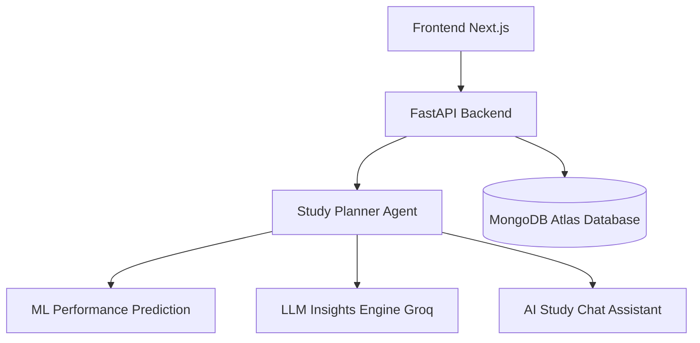

# 🚀 StudyForge AI 
### “An adaptive AI‑powered study planning and coaching system.” 🚀

An AI‑powered adaptive study planning system that generates personalized study schedules using Machine Learning, LLM reasoning, and adaptive feedback loops.

The system predicts student performance, creates optimized study plans, provides AI‑generated insights, and adapts schedules based on user progress.

## 📌 Features

### 🤖 AI Study Planner
Automatically generates a daily and weekly study schedule based on:
- Subject difficulty
- Previous performance
- Study hours
- Sleep hours
- Practice papers

### 📊 ML Performance Prediction
A trained Machine Learning model predicts student performance and identifies subjects that need more focus.
Used to compute:
- Priority scores
- Risk analysis
- Optimal study allocation

### 🧠 AI Study Insights (LLM)
Using Groq Llama models, the system provides intelligent insights like:
- Which subjects need more focus
- How to improve performance
- Study strategy suggestions

**Example output:**
> Focus more on Data Structures because the predicted score is low.  
> Increase practice papers for Mathematics to improve retention.  
> Maintain consistent sleep of 7–8 hours for better performance.

### 🧾 Explainable Study Plan
Students can ask: *"Why is this schedule generated?"*

The AI explains:
- Why certain subjects have higher priority
- How the study plan improves performance
- Strategy behind time allocation

*This provides Explainable AI (XAI).*

### 📈 Progress Tracking
Students can update their study progress.

**Example Request:**
```http
POST /update_progress
```

**Tracks:**
- Completed study hours
- Test scores
- Performance improvement

### 🎮 Gamified Study System
To increase motivation, the system provides:
- XP points for completed study hours
- Progress percentage
- AI motivational messages

**Example:**
> **Progress:** 75%  
> **XP Earned:** 40  
> **Motivation:** "Great progress! Keep pushing toward mastery."

### 💬 AI Study Chat Assistant
An AI tutor chatbot trained on the student's schedule. Students can ask questions like:
- *Which subject should I focus on today?*
- *Why is DSA my highest priority?*
- *How can I improve my math score?*

The chatbot responds using the student's actual study plan.

### 🔄 Adaptive Study Planner
The system adapts based on feedback:

1. **Study Progress**
2. **Performance Update**
3. **AI Recalculates Priority**
4. **Updated Study Plan**

*This creates an AI feedback loop for continuous improvement.*

## 🏗 System Architecture



## 🛠 Tech Stack

**Backend:**
- FastAPI (Python)
- Pydantic
- Uvicorn

**Machine Learning:**
- Scikit-learn (RandomForest Regressor)
- Pandas
- NumPy

**AI / LLM:**
- Groq API
- Llama 3.1 models

**Database:**
- MongoDB Atlas
- PyMongo

**Frontend:**
- Next.js
- React
- TailwindCSS

## 📂 Project Structure

```text
ai-study-planner-agent
│
├── src/
│   ├── api/
│   │   └── main.py
│   ├── database/
│   │   └── mongodb.py
│   ├── services/
│   │   ├── study_planner_agent.py
│   │   ├── performance_analyzer.py
│   │   ├── llm_insights.py
│   │   └── study_chatbot.py
│   └── models/
│       └── performance_model.pkl
│
├── tests/
│   ├── test_agent.py
│   └── check_data.py
│
├── notebooks/
│   └── model_training.ipynb
│
├── data/
│   └── Student_Performance.csv
│
├── .env
├── requirements.txt
└── README.md
```

## ⚙️ Installation

### 1️⃣ Clone Repository
```bash
git clone https://github.com/Biswajeet111/ai-study-planner-agent.git
cd ai-study-planner-agent
```

### 2️⃣ Create Virtual Environment
```bash
python -m venv venv
```

**Activate:**
- **Windows:**
  ```cmd
  venv\Scripts\activate
  ```
- **Mac / Linux:**
  ```bash
  source venv/bin/activate
  ```

### 3️⃣ Install Dependencies
```bash
pip install -r requirements.txt
```

### 4️⃣ Environment Variables
Create a `.env` file in the root directory:
```env
GROQ_API_KEY=your_api_key_here
MONGODB_URI=your_mongodb_connection_string
```

### 5️⃣ Run Backend
```bash
uvicorn src.api.main:app --reload
```
- **Server runs at:** `http://127.0.0.1:8000`
- **API docs (Swagger UI):** `http://127.0.0.1:8000/docs`

## 📡 API Endpoints

| Endpoint | Method | Description |
|---|---|---|
| `/generate_schedule` | `POST` | Generates a new study plan |
| `/explain_plan` | `POST` | Returns a detailed explanation of the generated plan |
| `/update_progress` | `POST` | Tracks progress and gives XP |
| `/study_chat` | `POST` | Chatbot to ask questions about your study plan |
| `/schedules` | `GET` | Retrieve stored schedules |
| `/motivation` | `GET` | Returns a motivational AI message |

### 🧪 Example Request (`POST /generate_schedule`)

```json
{
  "daily_hours": 6,
  "subjects": [
    {
      "name": "Math",
      "difficulty": 4,
      "previous_score": 60,
      "study_hours": 5,
      "sleep_hours": 7,
      "practice_papers": 3
    }
  ]
}
```

### 📊 Example Response

```json
{
  "daily_plan": { "...": "..." },
  "weekly_schedule": { "...": "..." },
  "priority_analysis": { "...": "..." },
  "ai_insights": "Focus more on DSA and increase practice papers."
}
```

## 🎯 Use Cases
- Personalized AI study planning
- Exam preparation optimization
- Smart tutoring systems
- Academic performance improvement
- AI-driven learning platforms

## 🚀 Future Improvements
- [ ] AI adaptive schedule updates
- [ ] Study streak system
- [ ] Leaderboard & gamification
- [ ] AI tutor voice assistant
- [ ] Performance analytics dashboard

## 👨‍💻 Contributors
- **[Biswajeet Kumar](https://github.com/Biswajeet111)** - AI / Backend Developer
- **Yash Raj** - Frontend Developer

## ⭐ Project Vision
This project demonstrates how Machine Learning + Large Language Models can be combined to create an intelligent adaptive learning assistant that improves student productivity and study efficiency.